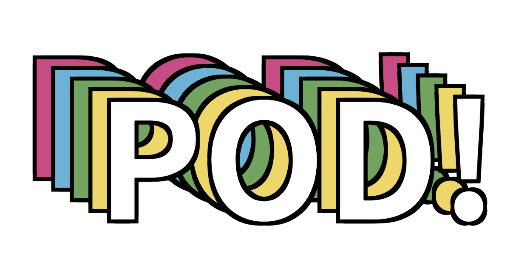

# Pod

**Pod**, your English learning Partner web app. Access at [Github Pages](https://r.piggy.lol/pod/) or [Vercel](https://pod-omega.vercel.app/pod/). This project is designed to help you improve your English by combining learning with typing. The main feature of Pod is to locate and emphasize crucial vocabulary in articles, aiding in memorization and comprehension.

## Supported Podcasts

Pod currently supports two types of podcasts:

1. **BBC 6 Minutes English Podcast**

2. **Scientific American Podcast**

All materials are sourced from the internet for educational purposes. If there are any copyright concerns, please contact me.

## Supported Vocabulary

0. CEFR (Common European Framework of Reference for Languages) B1-C1
1. AWL (Academic Word List) 570
2. GRE Manhattan Prep 1000
3. GRE Mason 2000

## Contribution

If you have any suggestions or would like to contribute to this project, please feel free to contact me. I am open to any ideas and improvements.
